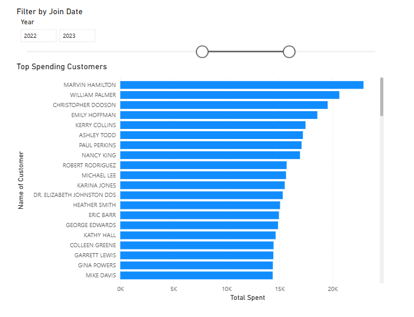
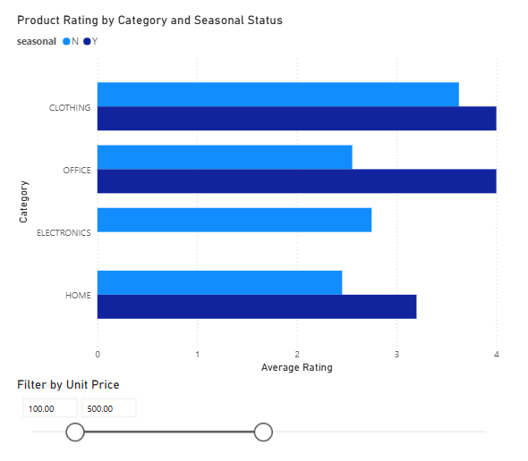
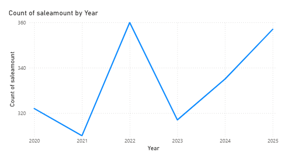
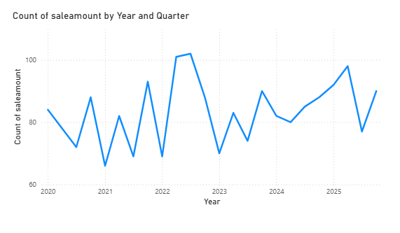
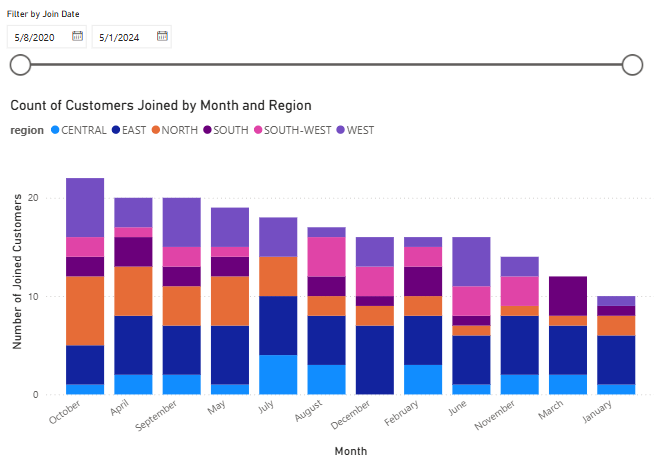
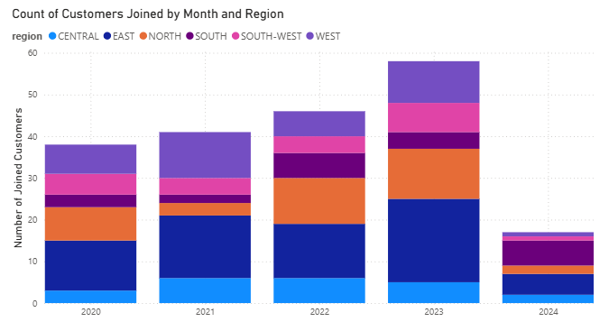
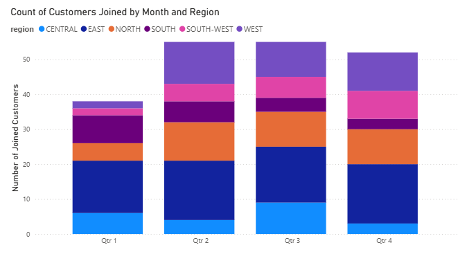

# Pro Analytics — smart-store-molly

Minimal, professional starter for analytics projects using Python.  
This repo contains ETL scripts, data prep utilities, logging helpers, tests, and docs to help you build reproducible analytics workflows.

## Quick Links
- Package entry: `analytics_project.main` (src/analytics_project/main.py)
- Demo modules:
  - `analytics_project.demo_module_basics`
  - `analytics_project.dw.etl_to_dw`
  - `analytics_project.data_prep`
  - `analytics_project.data_scrubber`

## Operating System and Tool Choices
- **Operating System:** Windows 11
- **Tools:** Python 3.x, Power BI, SQLite, loguru  

## How to Run
Create and activate a virtual environment:
```
uv venv
uv pip install -r requirements.txt
```

Run data prep:
```
uv run python -m analytics_project.data_prep
```

Run the DW load:
```
uv run python -m analytics_project.dw.etl_to_dw
```

Run the demo:
```
uv run python -m analytics_project.main
```

## Logging
Uses `loguru` for structured logging:
```
2025-11-15 12:56:30.386 | INFO | data_prep: Loaded customers_data.csv
```

## Data Prep (data_prep.py)
Performs:

- Duplicate removal
- String cleanup (upper + trimmed)
- Missing text fields → "UNKNOWN"
- Column normalization to snake_case
- **Preserves numeric identifiers (e.g. CampaignID)**

## Data Warehouse
Cleaned data is moved to data/warehouse/smart_sales.db using etl_to_dw.py

## Data Warehouse Schema Overview

### **Dimension Tables**
#### `customer`
| Column         | Type    |
|----------------|---------|
| customer_id    | INT PK  |
| first_name     | TEXT    |
| last_name      | TEXT    |
| email          | TEXT    |
| city           | TEXT    |
| state          | TEXT    |
| join_date      | DATE    |

#### `product`
| Column        | Type    |
|---------------|---------|
| product_id    | INT PK  |
| product_name  | TEXT    |
| category      | TEXT    |
| price         | NUMERIC |

### **Fact Table**
#### `sale`
| Column         | Type        |
|----------------|-------------|
| sale_id        | INT PK      |
| sale_date      | DATE        |
| customer_id    | INT FK      |
| product_id     | INT FK      |
| campaign_id    | INT FK NULL |
| quantity       | INT         |
| total_amount   | NUMERIC     |

## SQL Queries and Reports
- SQL queries extract and aggregate sales, product, and customer data from the warehouse.
- Reports include:
  - **Slice operations:** Top Spending Customers can be filtered/sliced by a range of join dates.
  - **Dice operations:** Product Rating can be viewed across product categories and wether or not the product is seasonal.
  - **Drilldown operations:** Sales can be viewed by Year, Quarter, or Month.

#### Power BI Model View


#### Slice Operation Results


#### Dice Operation Results


#### Drilldown Operation Results




## OLAP Analysis

#### The Business Goal
- What trends are present within the rewards program? 
  
#### Data Source
- The data warehouse (smart_sales.db) is the only source for this analysis.

#### Tools
- PowerBI was used for all visualizations.

#### Workflow and Logic
  - **Slice operations:** The count of customers who joined each month can be filtered by any range of dates. 
  - **Dice operations:** Region is also taken into account when looking at the count of customers over time.
  - **Drilldown operations:** Trends in join date can be seen across years, quarters, months, and days.

#### Results

- Across the whole dataset, the month with most instances of customers joining the rewards program is October.
  

- There is variation in trends across all regions, new joins appear sparse in the South and South-West, but consistent each month in the East.


- 2023 has the highest count of new joins.


- Quarters 2, 3, and 4 have a consistent amount of customer joins. Quarter 1 appears significantly lower.

#### Suggested Business Action
- Find which promotions were advertised and offered during periods of higher join dates, and consider pushing these offers to areas and time-periods of consistently low joins.

#### Challenges
- When attempting to create a slicer using the join_date field, I was unable to select the 'between' option. I had realized that my join_date was stored as text, not date. I easily switched this in table view of PowerBI and after refreshing, was able to select the correct slicer type.


